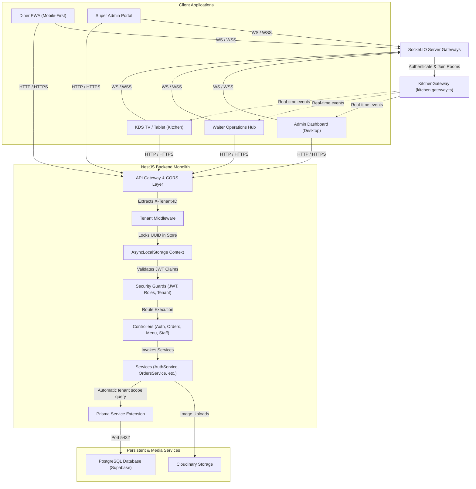
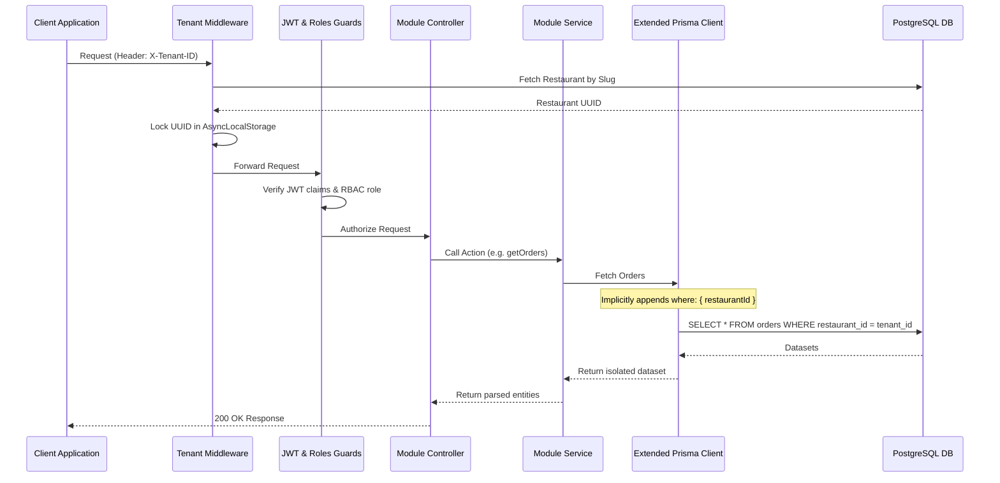
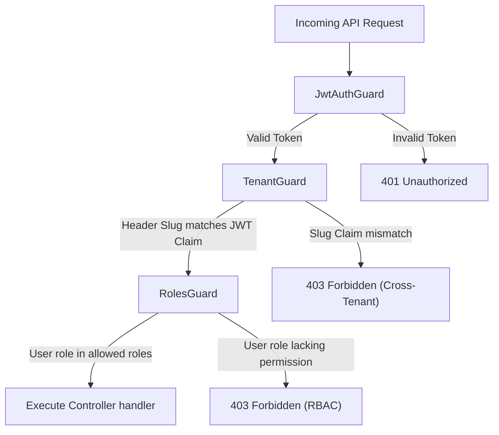
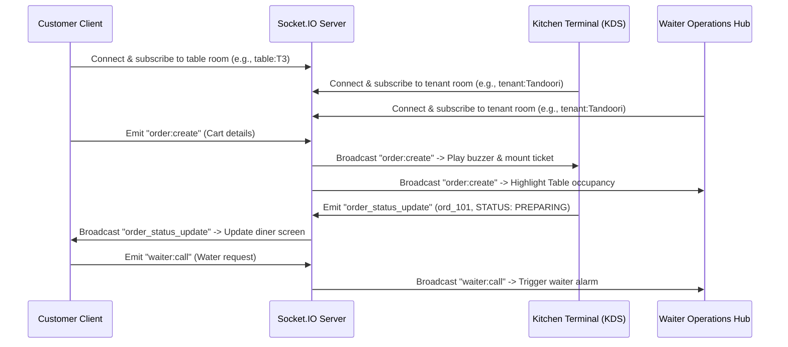

# System Architecture & Technical Specifications

This document outlines the high-level and detailed architecture of the Multi-Tenant QR Restaurant Ordering SaaS platform. It provides dynamic flow diagrams, request-response lifecycles, real-time gateways, and database isolation strategies.

---

## 1. High-Level Architecture

The platform operates on a decoupled client-server architecture. The frontend is built on **Next.js 15 (App Router)** and acts as the user interface layer for customers, restaurant staff, and the platform administrator. The backend is built on **NestJS (Modular Framework)**, serving REST endpoints and managing real-time WebSocket channels via Socket.IO.



---

## 2. Frontend Architecture

The frontend is a unified Next.js application that contains pages for five user personas. Routing is strictly managed via Next.js's file-system-based App Router.

### Dynamic Tenant Resolution & Theme Injection

Since this is a multi-tenant SaaS, compile-time branding builds are avoided. Instead, styling is resolved dynamically:
1.  **URL Mapping**: The diner scans a QR code leading to `/r/[tenant]/table/[tableId]`.
2.  **Layout Wrapping**: The `r/[tenant]` layout wraps all children inside a `TenantProvider` in [TenantContext.tsx](file:///home/enjay/myPP/frontend/src/context/TenantContext.tsx).
3.  **Branding Fetch**: The `TenantProvider` queries `/v1/restaurants/by-slug/:slug` to retrieve details like the primary colors, logo, and active features (e.g. `allowWaiterCall`).
4.  **HSL Color Injections**: Brand colors are injected directly into the HTML root element at runtime:
    ```typescript
    const applyTheme = (tenant: Tenant) => {
      const root = document.documentElement;
      root.style.setProperty('--primary', tenant.theme.primary);
      root.style.setProperty('--primary-foreground', tenant.theme.primaryForeground);
      root.style.setProperty('--radius', tenant.theme.radius);
    };
    ```
5.  **Tailwind Integration**: Tailwind config resolving rules (defined in [tailwind.config.js](file:///home/enjay/myPP/frontend/tailwind.config.js)) translate utility classes like `bg-primary` into CSS variables `hsl(var(--primary))`, causing the UI to adapt instantly to the restaurant's colors.

### Frontend Folder Structure Blueprint

```
frontend/src/
├── app/
│   ├── r/[tenant]/table/[tableId]/page.tsx   # Mobile-First Customer Menu & Ordering
│   ├── admin/dashboard/                     # Merchant analytics & configuration
│   ├── kitchen/page.tsx                     # Kitchen Display System (KDS) Terminal
│   ├── waiter/page.tsx                      # Waiter Hub
│   └── super-admin/page.tsx                 # Root system admin dashboard
├── components/                              # Reusable UI cards, tables, loading states
├── context/                                 # TenantContext provider
├── hooks/                                   # useSocket hook for room subscriptions
├── lib/                                     # Axios HTTP client, Socket.IO client singleton
└── store/                                   # Zustand stores (useCartStore, useUIStore)
```

---

## 3. Backend Architecture

The backend is organized into domain-specific NestJS modules (Auth, Users, Restaurants, Menu, Orders, Sockets, Staff).

```
backend/src/
├── app.module.ts               # Core module registry
├── main.ts                     # Entry point & Global middlewares
├── auth/                       # JWT Strategies, login handlers
├── common/                     # Multi-tenant context & security guards
├── menu/                       # Category, menu item, variant, addon modules
├── orders/                     # Order processing & state machine logic
├── prisma/                     # Extended PrismaService client
├── restaurants/                # Tenant setups & table registration
├── sockets/                    # Socket.IO notifications gateway
└── staff/                      # Employee schedules & assignments
```

### Request-Response Lifecycle Flow



---

## 4. Multi-Tenant Design & Restaurant Isolation

We use a **logical database isolation** approach via a shared-database, shared-schema setup. Every table representing tenant data includes a `restaurantId` foreign key referencing the `Restaurant` table.

### Data Security Fail-safes
1.  **AsyncLocalStorage**: Ensures that the `restaurantId` resolved by the middleware is securely locked to the active request thread, preventing cross-request context contamination.
2.  **Prisma Client Interception**: The `PrismaService` utilizes `$extends` to filter all operations. If the target model includes a `restaurantId` field, the Prisma extension automatically appends `where: { restaurantId }` to prevent database leaks.
3.  **Database Level Security (RLS)**: Row Level Security is enabled on database tables (managed via Supabase). If a query bypasses the application filters, PostgreSQL restricts the operations unless the database session variables match the tenant owner.

---

## 5. Security & Authorization Flow

System security relies on dual layers of authentication (JWT) and authorization (RBAC).



---

## 6. Real-time Communication Architecture

Real-time notifications are critical for restaurant operations. The system implements a **Pub/Sub WebSocket Gateway** using **Socket.IO** in the backend and a singleton manager in the frontend.



### Connection Rules & Safeguards
*   **Handshake Checks**: The server extracts `tenantId` from the WebSocket query params. Connections without a valid `tenantId` are disconnected.
*   **Targeted Broadcasts**: To prevent notifications from leaking to other restaurants, WebSocket events are emitted only to rooms scoped by tenant UUID (e.g., `tenant:{restaurantId}` or `tenant:{restaurantId}:table:{tableId}`).

---

## 7. Scaling & Resilience Recommendations

1.  **Connection Pooling**: Standard PostgreSQL database connections are limited. Implementing **PgBouncer** or **Supabase Supavisor** in Transaction Mode prevents connection exhaustion during busy dining hours.
2.  **Redis Caching**: Static resources (such as menus, brand setups, and table numbers) should be cached in Redis using a **Cache-Aside Pattern**. Writes to menu items should invalidate the cache.
3.  **Horizontal Scale (Stateless Backend)**: To scale the backend servers horizontally, WebSocket servers must sync connections across instances using a **Redis Adapter** (`@socket.io/redis-adapter`).
4.  **Database Read-Replicas**: Heavy analytical operations, such as generating end-of-day sales stats and reports, should be directed to read-only database replicas to keep the primary write transaction database fast.
