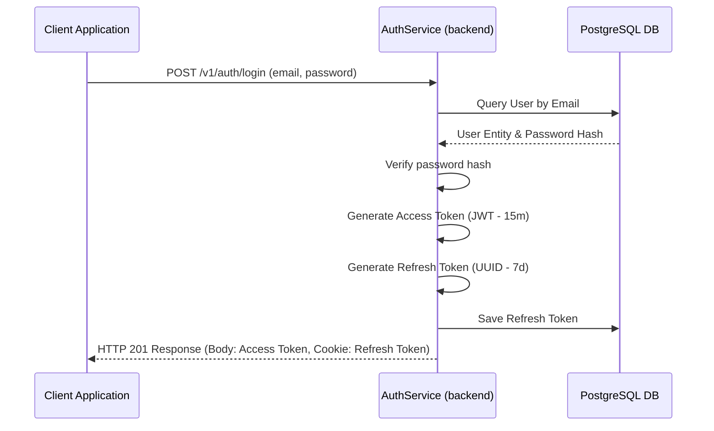
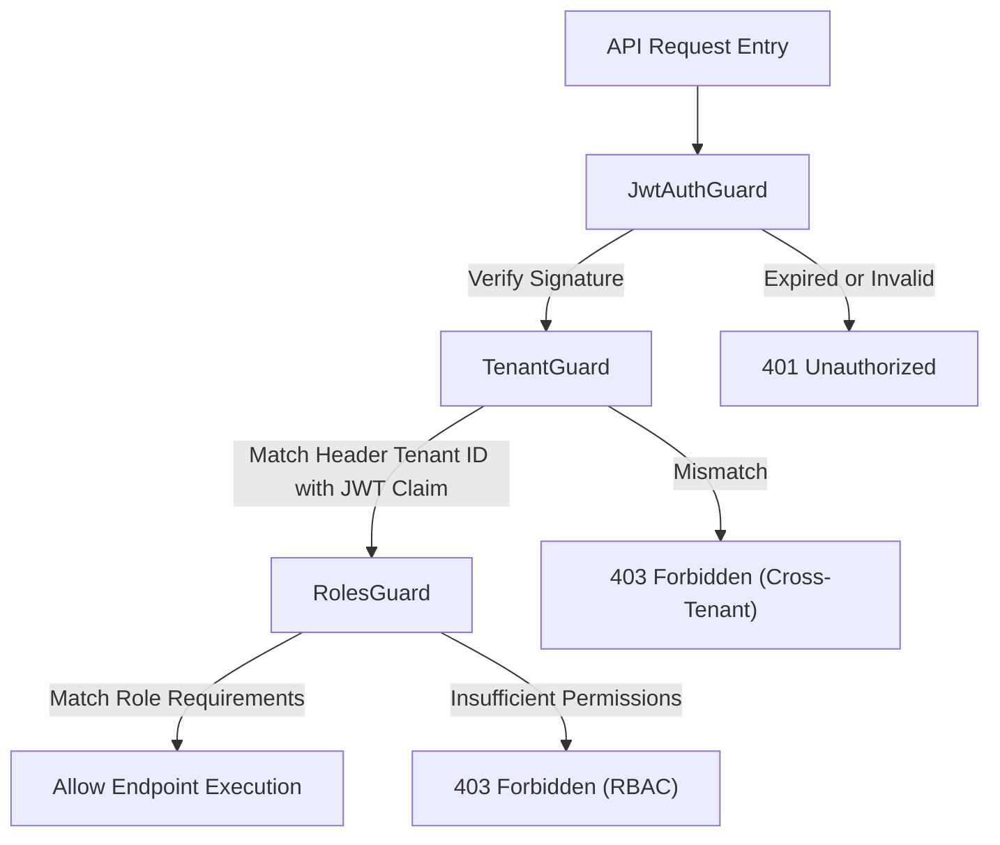

# Authentication & Authorization Specification

This document details the security structure, session lifecycle, token strategies, and permission checks of the platform.

---

## 1. Authentication Overview

Authentication is managed using **Access / Refresh Token pairs** with cryptographically secure storage.

*   **Access Token**: JWT format, 15-minute lifespan. Contains credentials claims (`userId`, `role`, `restaurantId`) to authorize requests.
*   **Refresh Token**: UUID string, 7-day lifespan. Saved in the database and returned to the client inside a secure, `HttpOnly`, `SameSite=Strict` cookie to fetch new access tokens without requiring credentials.
*   **Password Hashing**: Uses **Argon2** or **Bcrypt** with salt rounds to secure passwords against rainbow tables and brute-force attacks.



---

## 2. JWT Payload Structure

The generated Access Token contains the following payload claims:

```json
{
  "sub": "2d1b82e1-4560-496a-8b1e-089c891e4a3b",
  "email": "amit@tandoori.com",
  "role": "MANAGER",
  "restaurantId": "50c822e1-df08-410a-9d90-b98a12e12db4",
  "iat": 1782782400,
  "exp": 1782783300
}
```

---

## 3. Protecting Routes (Guards Pipeline)

NestJS endpoints are protected by chaining multiple Guards. When a client calls a protected route, the request executes through this validation stack:



### 3.1. `JwtAuthGuard`
Uses the Passport strategy defined in [jwt.strategy.ts](file:///home/enjay/myPP/backend/src/auth/strategies/jwt.strategy.ts). It extracts the token from the `Authorization: Bearer <Token>` header, decodes the signature, and populates the `req.user` context.

### 3.2. `TenantGuard`
Secures against cross-tenant data requests. It ensures that the client's `X-Tenant-ID` header value matches the `restaurantId` claim inside the decoded JWT token. This prevents users from one restaurant from modifying data at another restaurant.

### 3.3. `RolesGuard`
Enforces Role-Based Access Control (RBAC). It reads metadata attached via the `@Roles('MANAGER', 'CASHIER')` decorator and compares it with the user's role:
*   If the user's role is in the allowed list, the request is authorized.
*   If not, the guard throws a `403 Forbidden` exception.

---

## 4. Role Authorization Matrix

The table below outlines the operations allowed for each user role:

| Endpoint Resource | super_admin | restaurant_admin | manager | cashier | kitchen_staff | waiter | customer |
| :--- | :---: | :---: | :---: | :---: | :---: | :---: | :---: |
| **Manage Tenants** | Yes | No | No | No | No | No | No |
| **Delete Restaurant**| Yes | No | No | No | No | No | No |
| **Modify Tax Rates** | Yes | Yes | No | No | No | No | No |
| **Add/Modify Staff** | Yes | Yes | Yes | No | No | No | No |
| **Configure Tables** | Yes | Yes | Yes | No | No | No | No |
| **Create Menu Item** | Yes | Yes | Yes | No | No | No | No |
| **Delete Menu Item** | Yes | Yes | Yes | No | No | No | No |
| **Accept Orders** | Yes | Yes | Yes | Yes | No | Yes | No |
| **Mark Order Ready** | Yes | Yes | Yes | Yes | Yes | Yes | No |
| **Settle Payment** | Yes | Yes | Yes | Yes | No | No | No |
| **Call Waiter** | No | No | No | No | No | No | Yes |
| **Browse Menus** | Yes | Yes | Yes | Yes | Yes | Yes | Yes |
