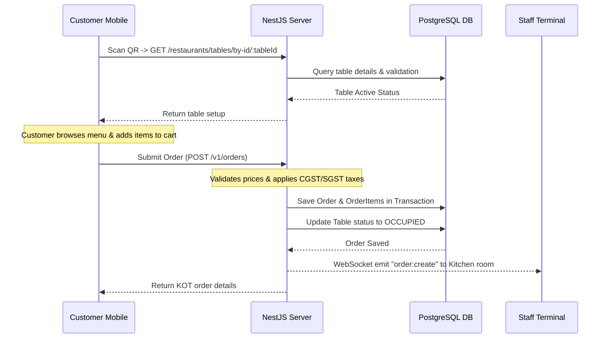
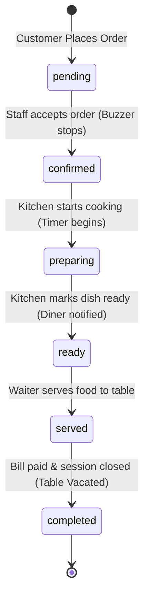

# Core Business Logic & Workflows

This document explains the primary business operations and logical workflows implemented in the platform in plain English.

---

## 1. QR Table Ordering Flow

*   **Scan & Resolve**: When a customer scans a table's QR code, the PWA extracts the table UUID from the URL path. It makes an API call to verify if the table is registered and marked active. If yes, it retrieves the restaurant's branding, HSL theme configuration, and category menu catalog.
*   **Menu Customization**: The customer adds items to their cart. If an item requires customizations (such as choosing a portion size or extra toppings), the checkout drawer validates that the mandatory customization groups are satisfied before allowing checkout.
*   **Checkout & Calculations**: Tapping "Confirm and Send" calculates the invoice:
    *   **Base Subtotal**: Sum of item prices + selected customization option prices.
    *   **Indian Taxation (GST)**: Automatically calculates Central GST (CGST) and State GST (SGST) based on tax rates (default: 2.5% each) configured in the restaurant settings.
    *   **Service Charge**: Calculates an optional service charge (default: 5.0%) based on restaurant settings.
    *   **Grand Total**: The subtotal plus taxes and charges.
*   **Order Submission**: The order is sent to the backend. The backend executes a database transaction that:
    1.  Calculates and verifies item prices to prevent price tampering.
    2.  Creates the `Order` and `OrderItem` records.
    3.  Updates the `Table` status from `VACANT` to `OCCUPIED`.
    4.  Broadcasts the new order to the kitchen gateway.

---

## 2. Kitchen Display System (KDS) Workflow

*   **Order Arrival**: When an order is placed, the KDS client receives a `kitchen_kot_new` WebSocket event, plays a buzzer sound, and renders a new ticket card containing the dishes, quantities, and cooking notes.
*   **Timer & Visual Alerts**: A timer displays how long the ticket has been in the queue. Card borders change color to indicate age:
    *   **Normal**: Green ($<10$ mins)
    *   **Delayed**: Amber ($10-15$ mins)
    *   **Late**: Crimson ($>15$ mins)
*   **Workflow Steps**:
    1.  **Accept**: The cashier or waiter accepts the order, changing the status from `pending` to `confirmed`.
    2.  **Start Cooking**: The kitchen begins preparing the dishes, changing the status to `preparing`.
    3.  **Mark Ready**: When cooking is complete, staff marks the order as `ready`. The KDS emits a WebSocket alert to notify the waiter and the customer's browser.
    4.  **Mark Served**: The waiter delivers the dishes and updates the order status to `served`.

---

## 3. Waiter Paging & Assistance Flow

*   **Calling for Help**: If a customer needs assistance, they open the helper menu in the PWA and select a reason (e.g. "Request Water", "Bring Cutlery", "Request Bill", or "Call Waiter").
*   **Alert Broadcast**: The client emits a `waiter:call` WebSocket event containing the table number and request reason.
*   **Waiter Response**: Waiter tablets receive the alert, play a chime, highlight the requesting table, and display the request details.
*   **Resolution**: Once the request is handled, the waiter taps "Resolve Alert" on their dashboard, clearing the alert from the active queue.

---

## 4. Session Closure & Table Settle Flow

*   **Requesting the Bill**: Once the meal is finished, the customer requests the bill. The table status changes to `WAITING_BILL`, alerting the cashier.
*   **Payment & Settlement**: The customer settles the bill (via UPI, cash, or card).
*   **Table Reset**: The cashier processes the payment, updates the order status to `completed`, and resets the table status back to `VACANT` in a database transaction, clearing the table session for the next customer.
