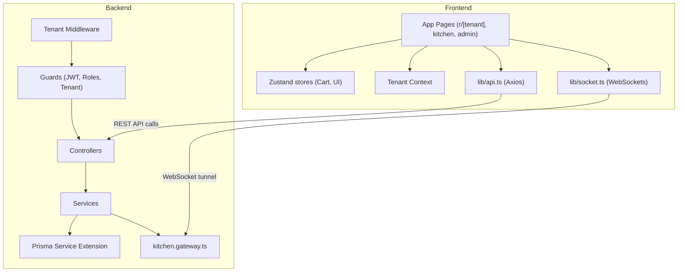

# Codebase Structure & Module Architecture

This document describes the directory structure, module purposes, and dependencies for the platform.

---

## 1. System Folder Map

The project is structured as a monorepo containing a separate Next.js client (`frontend/`) and a NestJS server (`backend/`).

```
QR-Ordering-SAAS-app/
├── backend/                       # NestJS Backend API Monolith
│   ├── prisma/                    # Schema, migrations, and seed scripts
│   └── src/                       # Application code
│       ├── auth/                  # JWT generation & session verification
│       ├── common/                # Shared filters, guards, and decorators
│       ├── menu/                  # Menu items, variants, categories, and addons
│       ├── orders/                # Orders database and status machine rules
│       ├── prisma/                # Extended database client service
│       ├── restaurants/           # Tenant metadata & settings
│       ├── sockets/               # Real-time WebSocket gateway
│       ├── staff/                 # Employees management
│       └── users/                 # Main credentials and reset-pass APIs
│
├── frontend/                      # Next.js App Router Client App
│   ├── public/                    # PWA Manifest, icons, and static assets
│   └── src/                       # Application code
│       ├── app/                   # Dynamic Next.js file-system routes
│       │   ├── r/[tenant]/        # Diner ordering pages
│       │   ├── admin/             # Dashboard and table QR exports
│       │   ├── kitchen/           # Kitchen Display System (KDS)
│       │   └── waiter/            # Floor service alerts chimes
│       ├── components/            # Reusable components
│       ├── context/               # Tenant context and themes manager
│       ├── hooks/                 # WebSocket hook wrappers
│       ├── lib/                   # API client and WebSocket singletons
│       ├── store/                 # Zustand stores (Cart, UI, Toasts)
│       └── styles/                # Global tailwind rules
```

---

## 2. Directory Specifications

### 2.1. Backend (`backend/`)

*   **`prisma/`**: Contains the [schema.prisma](file:///home/enjay/myPP/backend/prisma/schema.prisma) mapping file, database migration folders, and the database seeder file [seed.js](file:///home/enjay/myPP/backend/prisma/seed.js).
*   **`src/auth/`**: Exposes `/v1/auth` endpoints. Implements password verification, token generation, and Passport JWT strategy configurations.
*   **`src/common/`**: Contains global middleware, guards, filters, and decorators:
    *   `tenant.middleware.ts` extracts tenant headers and stores context.
    *   `tenant.guard.ts` secures requests against cross-tenant data access.
    *   `roles.guard.ts` validates RBAC permissions.
    *   `global-exception.filter.ts` catches database and route exceptions, formatting them into structured error responses.
*   **`src/menu/`**: Implements catalog CRUD endpoints. Divided into categories, menu items, addons, and variants controllers and services.
*   **`src/orders/`**: Processes customer checkouts, KOT generation, tax calculations, and status transitions validated by the state machine in `orders.state.ts`.
*   **`src/prisma/`**: Declares the extended Prisma client. Extends Prisma queries to automatically filter results by the active tenant ID in `AsyncLocalStorage`.
*   **`src/sockets/`**: Hosts the Socket.IO gateway (`kitchen.gateway.ts`) to manage room subscriptions and real-time event broadcasts.

### 2.2. Frontend (`frontend/`)

*   **`src/app/r/[tenant]/`**: Serves the customer-facing PWA. Retrieves menus, handles variant selection, saves orders to the cart, and displays live KOT tracking.
*   **`src/app/admin/`**: Serves the merchant dashboard. Contains modules for managing categories, menu items, tables, and staff, and generating table QR codes.
*   **`src/app/kitchen/`**: Renders the KDS queue, displays prep timers, and emits chimes for incoming orders.
*   **`src/app/waiter/`**: Renders floor management controls and lists active waiter calls from tables.
*   **`src/context/`**: Injects branding stylesheets dynamically into the root DOM using brand configurations resolved from the tenant context.
*   **`src/store/`**: Declares global Zustand stores:
    *   `useCartStore.ts` handles persistent cart items, variant selections, and tax calculations.
    *   `useUIStore.ts` manages modal windows, search terms, and active filters.
    *   `useToastStore.ts` shows notifications across the application.

---

## 3. Module Dependency Graph


