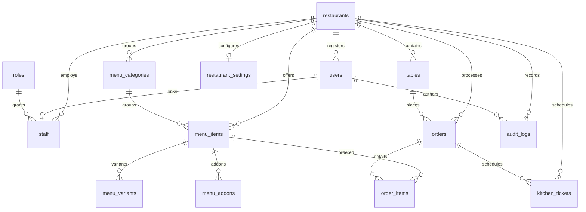

# Relational Database Specifications & Schema Documentation

This document describes the database design for the Multi-Tenant QR Restaurant Ordering SaaS platform. The database runs on **PostgreSQL** and is managed via **Prisma ORM**.

---

## 1. Database Entity Relationship Diagram (ERD)

The database utilizes a **Shared-Schema Multi-Tenancy** approach. All operations are isolated by `restaurant_id` columns, which map directly back to the parent `restaurants` registry.

---

## 2. Table Specifications & Columns

### 2.1. `restaurants`
Stores tenant entities. Each restaurant runs in its own context using its unique `slug`.

| Column | Type | Constraints | Description |
| :--- | :--- | :--- | :--- |
| `id` | UUID | Primary Key, Default UUID | Unique identifier of the tenant |
| `name` | VARCHAR | NOT NULL | Restaurant name |
| `slug` | VARCHAR | UNIQUE, INDEX, NOT NULL | URL-friendly lookup slug |
| `logo` | VARCHAR | Nullable | Logo image URL hosted on CDN |
| `owner_name` | VARCHAR | Nullable | Name of the restaurant owner |
| `owner_email`| VARCHAR | Nullable | Email address of the owner |
| `phone` | VARCHAR | Nullable | Contact number |
| `address` | TEXT | Nullable | Restaurant address |
| `subscription_status` | VARCHAR | Default: `"active"` | SaaS Billing subscription status |
| `is_active` | BOOLEAN | Default: `true` | Platform active status toggle |
| `max_tables` | INTEGER | Default: `10` | Maximum table allocation limit |
| `created_at` | TIMESTAMP | Default: `now()` | Date created |
| `updated_at` | TIMESTAMP | Auto-update | Date last updated |
| `deleted_at` | TIMESTAMP | Nullable | Soft delete tracking |

---

### 2.2. `users`
Global platform users, including super administrators and restaurant staff.

| Column | Type | Constraints | Description |
| :--- | :--- | :--- | :--- |
| `id` | UUID | Primary Key, Default UUID | Unique identifier |
| `restaurant_id` | UUID | FK (restaurants.id), Cascade | Linked tenant (Null for super admins) |
| `full_name` | VARCHAR | NOT NULL | User's full name |
| `email` | VARCHAR | UNIQUE, NOT NULL | User's email credentials |
| `password_hash` | VARCHAR | NOT NULL | Argon2 / Bcrypt password hash |
| `role` | VARCHAR | Default: `"RESTAURANT_ADMIN"` | Role name (SUPER_ADMIN, WAITER, etc.) |
| `is_active` | BOOLEAN | Default: `true` | Status toggle |
| `last_login_at` | TIMESTAMP | Nullable | Last login record |
| `created_at` | TIMESTAMP | Default: `now()` | Date created |
| `updated_at` | TIMESTAMP | Auto-update | Date updated |

---

### 2.3. `roles`
Stores roles available for staff permission mappings.

| Column | Type | Constraints | Description |
| :--- | :--- | :--- | :--- |
| `id` | UUID | Primary Key, Default UUID | Unique identifier |
| `name` | VARCHAR | UNIQUE, NOT NULL | Role Name (SUPER_ADMIN, MANAGER, etc.) |
| `created_at` | TIMESTAMP | Default: `now()` | Date created |

---

### 2.4. `staff`
Intermediate table mapping users to restaurants and roles.

| Column | Type | Constraints | Description |
| :--- | :--- | :--- | :--- |
| `id` | UUID | Primary Key, Default UUID | Unique identifier |
| `restaurant_id` | UUID | FK (restaurants.id), Cascade | Linked tenant |
| `user_id` | UUID | FK (users.id), Cascade | Linked user credentials |
| `role_id` | UUID | FK (roles.id) | Assigned role reference |
| `is_available` | BOOLEAN | Default: `true` | Work shift availability flag |
| `created_at` | TIMESTAMP | Default: `now()` | Date created |

---

### 2.5. `tables`
Physical tables in the dining area.

| Column | Type | Constraints | Description |
| :--- | :--- | :--- | :--- |
| `id` | UUID | Primary Key, Default UUID | Unique identifier |
| `restaurant_id` | UUID | FK (restaurants.id), Cascade | Parent tenant |
| `name` | VARCHAR | NOT NULL | Table indicator (e.g. "Table 3") |
| `status` | TableStatus | Default: `VACANT` | Table state (Enum: VACANT, OCCUPIED, DIRTY) |
| `active_session_id` | VARCHAR | Nullable | Customer dining session identifier |
| `is_active` | BOOLEAN | Default: `true` | Activation flag |
| `qr_code_url` | VARCHAR | Nullable | Generated table QR link |
| `created_at` | TIMESTAMP | Default: `now()` | Date created |

---

### 2.6. `menu_categories`
Catalog groups for organization.

| Column | Type | Constraints | Description |
| :--- | :--- | :--- | :--- |
| `id` | UUID | Primary Key, Default UUID | Unique identifier |
| `restaurant_id` | UUID | FK (restaurants.id), Cascade | Parent tenant |
| `name` | VARCHAR | NOT NULL | Category name (e.g., "Starters") |
| `description` | TEXT | Nullable | Brief description |
| `image_url` | VARCHAR | Nullable | Banner image URL |
| `sort_order` | INTEGER | Default: `0` | Sort weight for UI layouts |
| `is_available` | BOOLEAN | Default: `true` | Category availability toggle |
| `created_at` | TIMESTAMP | Default: `now()` | Date created |

---

### 2.7. `menu_items`
Dishes served by restaurants.

| Column | Type | Constraints | Description |
| :--- | :--- | :--- | :--- |
| `id` | UUID | Primary Key, Default UUID | Unique identifier |
| `restaurant_id` | UUID | FK (restaurants.id), Cascade | Parent tenant |
| `category_id` | UUID | FK (menu_categories.id), Cascade | Parent category group |
| `name` | VARCHAR | NOT NULL | Dish name |
| `description` | TEXT | NOT NULL | Details / Ingredients list |
| `price` | DECIMAL(10,2) | NOT NULL | Base cost |
| `discount_price` | DECIMAL(10,2) | Nullable | Discounted cost |
| `is_veg` | BOOLEAN | Default: `true` | FSSAI Veg logo indicator |
| `food_type` | FoodType | Default: `VEG` | Dietary classification (Enum) |
| `prep_time` | INTEGER | Default: `15` | Expected prep duration (minutes) |
| `is_available` | BOOLEAN | Default: `true` | In-stock toggle |
| `is_featured` | BOOLEAN | Default: `false` | Featured item placement |
| `is_bestseller` | BOOLEAN | Default: `false` | Bestseller tag |
| `image_url` | VARCHAR | Nullable | Dish image CDN path |

---

### 2.8. `menu_variants`
Dishes size options (e.g. "Half" vs "Full").

| Column | Type | Constraints | Description |
| :--- | :--- | :--- | :--- |
| `id` | UUID | Primary Key, Default UUID | Unique identifier |
| `menu_item_id` | UUID | FK (menu_items.id), Cascade | Parent dish |
| `name` | VARCHAR | NOT NULL | Option label |
| `price` | DECIMAL(10,2) | NOT NULL | Option cost |
| `sort_order` | INTEGER | Default: `0` | Order weight |

---

### 2.9. `menu_addons`
Optional modifiers (e.g. "Extra Cheese").

| Column | Type | Constraints | Description |
| :--- | :--- | :--- | :--- |
| `id` | UUID | Primary Key, Default UUID | Unique identifier |
| `menu_item_id` | UUID | FK (menu_items.id), Cascade | Parent dish |
| `name` | VARCHAR | NOT NULL | Modifier label |
| `price` | DECIMAL(10,2) | NOT NULL | Modifier cost |

---

### 2.10. `orders`
Dining order records.

| Column | Type | Constraints | Description |
| :--- | :--- | :--- | :--- |
| `id` | UUID | Primary Key, Default UUID | Unique identifier |
| `restaurant_id` | UUID | FK (restaurants.id), Cascade | Parent tenant |
| `table_id` | UUID | FK (tables.id), Cascade | Origin table |
| `kot_number` | VARCHAR | NOT NULL | Sequenced Kitchen Order Ticket tag |
| `status` | OrderStatus | Default: `pending` | Enum: pending, confirmed, preparing, ready, served... |
| `subtotal` | DECIMAL(10,2) | NOT NULL | Sum of items before tax |
| `cgst` | DECIMAL(10,2) | NOT NULL | Central GST amount |
| `sgst` | DECIMAL(10,2) | NOT NULL | State GST amount |
| `service_charge`| DECIMAL(10,2) | NOT NULL | Optional service fee |
| `grand_total` | DECIMAL(10,2) | NOT NULL | Final invoice total |
| `special_instructions` | TEXT | Nullable | Cooking notes from diner |
| `created_at` | TIMESTAMP | Default: `now()` | Date placed |

---

### 2.11. `order_items`
Diner order lines.

| Column | Type | Constraints | Description |
| :--- | :--- | :--- | :--- |
| `id` | UUID | Primary Key, Default UUID | Unique identifier |
| `order_id` | UUID | FK (orders.id), Cascade | Parent order |
| `menu_item_id` | UUID | FK (menu_items.id) | Linked dish |
| `name` | VARCHAR | NOT NULL | Snapshot of item name |
| `quantity` | INTEGER | NOT NULL | Ordered count |
| `price` | DECIMAL(10,2) | NOT NULL | Price snapshot |
| `customizations`| JSON | NOT NULL | Selected addons and variants JSON array |

---

### 2.12. `kitchen_tickets`
Queue tickets for the KDS.

| Column | Type | Constraints | Description |
| :--- | :--- | :--- | :--- |
| `id` | UUID | Primary Key, Default UUID | Unique identifier |
| `restaurant_id` | UUID | FK (restaurants.id), Cascade | Parent tenant |
| `order_id` | UUID | FK (orders.id), Cascade | Parent order reference |
| `kot_number` | VARCHAR | NOT NULL | KOT label copy |
| `status` | OrderStatus | Default: `pending` | Current cooking state |
| `elapsed_minutes` | INTEGER | Default: `0` | Queue age tracking |

---

### 2.13. `restaurant_settings`
Tenant configurations, including tax percentages.

| Column | Type | Constraints | Description |
| :--- | :--- | :--- | :--- |
| `id` | UUID | Primary Key, Default UUID | Unique identifier |
| `restaurant_id` | UUID | UNIQUE, FK (restaurants.id), Cascade | Target tenant reference |
| `is_veg_only` | BOOLEAN | Default: `false` | Veg-only menu filter flag |
| `allow_upi_payments` | BOOLEAN | Default: `true` | Digital payment enablement |
| `allow_waiter_call` | BOOLEAN | Default: `true` | Waiter paging feature flag |
| `cgst_rate` | DECIMAL(5,2) | Default: `2.50` | Central GST rate (in %) |
| `sgst_rate` | DECIMAL(5,2) | Default: `2.50` | State GST rate (in %) |
| `service_charge_rate` | DECIMAL(5,2) | Default: `5.00` | Optional service fee (in %) |
| `qr_fg_color` | VARCHAR | Default: `"#000000"` | Generated QR foreground color hex |
| `qr_bg_color` | VARCHAR | Default: `"#ffffff"` | Generated QR background color hex |

---

### 2.14. `audit_logs`
Logs sensitive actions for auditing.

| Column | Type | Constraints | Description |
| :--- | :--- | :--- | :--- |
| `id` | UUID | Primary Key, Default UUID | Unique identifier |
| `restaurant_id` | UUID | FK (restaurants.id), SetNull | Related tenant |
| `user_id` | UUID | FK (users.id), SetNull | Authorized operator |
| `action` | VARCHAR | NOT NULL | Action name (e.g. `DELETE_STAFF`) |
| `details` | TEXT | NOT NULL | JSON or string data details |
| `ip_address` | VARCHAR | Nullable | Operator IP |
| `created_at` | TIMESTAMP | Default: `now()` | Date logged |

---

## 3. Database Indexes

To keep queries fast during busy periods:
*   **Unique Index**: `restaurants(slug)` - Speeds up tenant URL lookups.
*   **Unique Index**: `tables(restaurant_id, name)` - Blocks table name collisions within a restaurant.
*   **Unique Index**: `staff(restaurant_id, user_id)` - Prevents double enrollment of users.
*   **Composite Index**: `menu_items(restaurant_id, category_id, is_available)` - Optimizes menu retrieval.
*   **Composite Index**: `orders(restaurant_id, status, created_at DESC)` - Optimizes dashboard sorting.

---

## 4. Multi-Tenant Cascade Deletion Rules

We enforce relational integrity using Prisma cascade actions:
*   Deleting a `Restaurant` cascade-deletes all its `users`, `staff`, `tables`, `menuCategories`, `menuItems`, `orders`, `kitchenTickets`, and `restaurantSettings`.
*   Deleting a `User` cascade-deletes their nested `staff` connections.
*   Deleting a `MenuCategory` cascade-deletes its `menuItems`.
*   Deleting a `MenuItem` cascade-deletes its `variants` and `addons`.
*   Deleting an `Order` cascade-deletes its `orderItems` and `kitchenTickets`.

For auditing safety, deleting a `Restaurant` or a `User` retains `audit_logs` records but sets their foreign keys (`restaurant_id` and `user_id`) to `null`.
