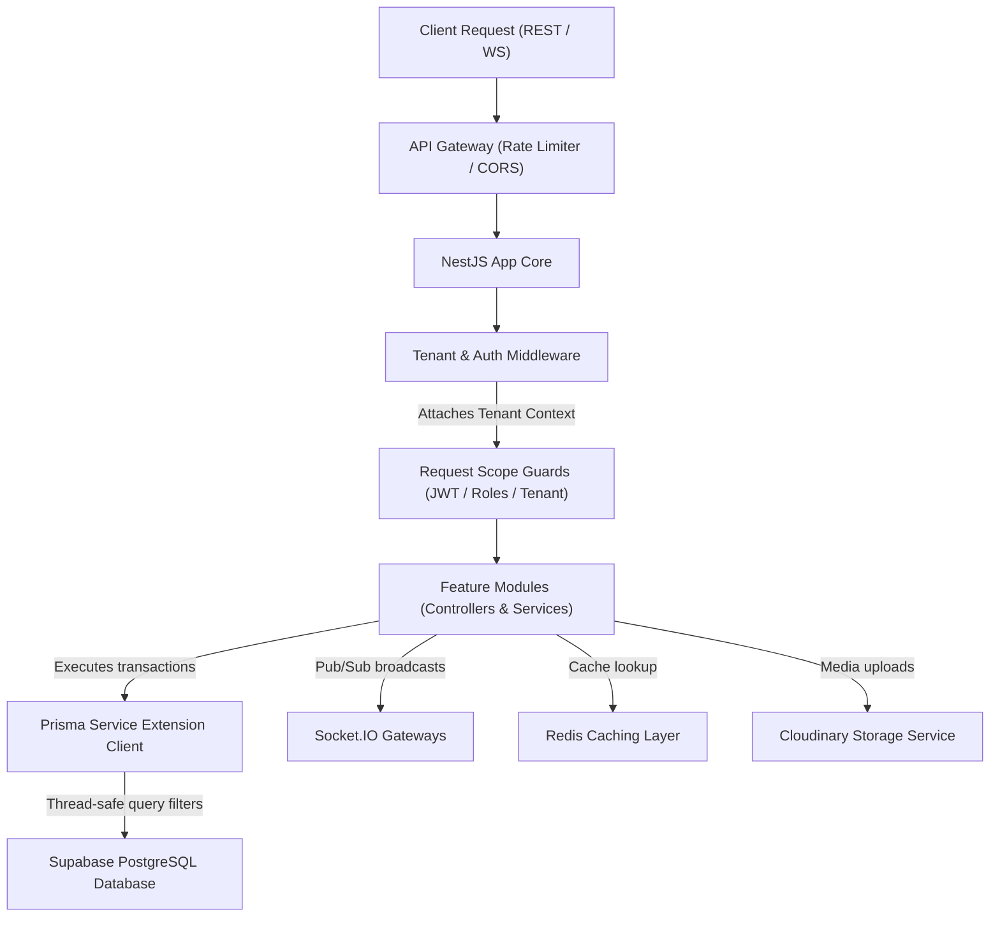
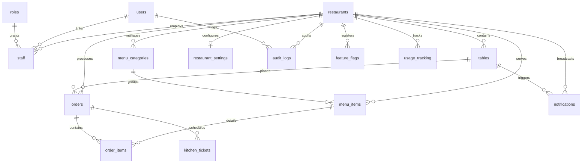

# Backend Architectural Specification: Multi-Tenant QR Restaurant Ordering SaaS

This specification establishes the production-ready backend architecture, database designs, multi-tenant partitioning logic, security layers, API endpoints, and scaling plans for the Multi-Tenant QR Restaurant Ordering SaaS Platform.

---

## 1. Backend Architecture

The backend system is designed using a **NestJS Modular Architecture** with a shared database model. This structure guarantees clean separation of domains (Auth, Menu, Orders, Analytics, Sockets) while sharing core resources like the database agent.

### System Flow Diagram



---

## 2. SaaS Multi-Tenant Strategy

The platform operates on a **shared-database, shared-schema** architecture (single logical database, single schema instance) utilizing `restaurant_id` column flags to isolate tenant resources.

### Tenant Isolation Pipeline

1. **Context Extraction**: The client passes the restaurant identifier in the `X-Tenant-ID` header.
2. **AsyncLocalStorage Binding**: NestJS middleware intercepts the request, reads the header, and binds it to a thread-safe context (`AsyncLocalStorage`).
3. **Guards Verification**: The `TenantGuard` verifies that the `restaurant_id` claims inside the caller's JWT match the header context.
4. **ORM Query Enforcement**: The `PrismaService` client extension intercepts all read/write calls, automatically appending `where: { restaurantId }` filters to query payloads.
5. **Database RLS Policies**: Row Level Security (RLS) is enabled on Supabase PostgreSQL tables as a database-level fail-safe.

---

## 3. Complete Database Design

The database schema is designed to represent a normalized restaurant ordering model. Soft deletes, composite indexes on tenant keys, and audit timestamps are enforced globally.

### Entity Relationship Diagram (ERD)



### Table Specifications & Index Rules

To ensure query latency remains below 20ms during peak dining rush hours, the following index strategies are applied:
1. **Tables/Staff Unique Constraints**: Unique indexes on `staff(restaurant_id, user_id)` and `tables(restaurant_id, name)` prevent duplicate listings.
2. **Category sorting composite index**: `idx_menu_items_tenant_category` on `menu_items(restaurant_id, category_id, is_available)` speeds up menu fetching.
3. **Active Order Lookup Index**: `idx_orders_tenant_status_date` on `orders(restaurant_id, status, created_at DESC)` optimizes live dashboard sorting.
4. **Soft Delete Tracking**: Deleted elements are flagged with `deleted_at IS NULL` indexes to keep query scans clean.

---

## 4. Prisma Schema

The complete database mapping configuration is specified in the [schema.prisma](file:///home/enjay/myPP/backend/prisma/schema.prisma) file. It defines the tables, relationships, foreign keys, and indexes for all requested modules.

---

## 5. NestJS Folder Structure

```
backend/
├── prisma/
│   └── schema.prisma               # Prisma relational database mappings
├── src/
│   ├── app.module.ts               # Core root module registry
│   ├── main.ts                     # App entrypoint and global middleware bindings
│   ├── common/                     # Shared filters, decorators, and interceptors
│   │   ├── decorators/
│   │   │   ├── roles.decorator.ts  # Role annotations (@Roles)
│   │   │   └── tenant.decorator.ts # Extracts tenant context from request parameters
│   │   ├── guards/
│   │   │   ├── jwt-auth.guard.ts   # Validates incoming JWT tokens
│   │   │   ├── roles.guard.ts      # Enforces RBAC permissions check
│   │   │   └── tenant.guard.ts     # Enforces Cross-Tenant protection checks
│   │   └── middleware/
│   │       └── tenant.middleware.ts # Extracts and locks tenant contexts in AsyncLocalStorage
│   ├── prisma/
│   │   ├── prisma.module.ts
│   │   └── prisma.service.ts       # Extends client with automatic query filters
│   ├── auth/
│   │   ├── auth.controller.ts
│   │   ├── auth.service.ts         # Authentication logic (passwords, JWTs)
│   │   └── dto/
│   │       ├── login.dto.ts
│   │       └── refresh.dto.ts
│   ├── orders/
│   │   ├── orders.controller.ts
│   │   ├── orders.service.ts       # Order calculations and transactional state transitions
│   │   ├── orders.state.ts         # Finite state machine validator
│   │   └── dto/
│   │       ├── create-order.dto.ts
│   │       └── update-status.dto.ts
│   └── sockets/
│       ├── sockets.module.ts
│       └── kitchen.gateway.ts      # Socket.IO rooms router and live updates handler
```

---

## 6. Authentication Design

Authentication is managed using **Access/Refresh Token pairs** with password hashing.

### Authentication Lifecycle Flow

```
1. Customer/Staff enters credentials -> POST /auth/login
2. Service validates password using argon2 or bcrypt
3. Service generates:
   - Access Token (JWT, TTL: 15 mins) -> contains userId, role, restaurantId
   - Refresh Token (UUID, TTL: 7 days) -> saved in database with hashed signature
4. Client stores Access Token in memory, Refresh Token in secure HttpOnly cookie
5. Token Expiry -> Client requests POST /auth/refresh with HttpOnly cookie
6. Service validates token against database and issues new Access Token
```

* **DTO Validation**: Class-validator is applied to all incoming DTO fields to enforce properties and sanitization (e.g. `@IsEmail()`, `@IsString()`, `@MinLength(8)`).
* **Input Sanitization**: NestJS binds class-transformer sanitizers to strip unregistered properties and escape special SQL/HTML characters.
* **Rate Limiting**: Enforced via NestJS Throttler module. Public auth routes are throttled to 10 requests/minute per IP address.

---

## 7. Authorization Design (RBAC)

The platform implements a Role-Based Access Control (RBAC) authorization layer:

### Permission Matrix

| Role | Menu Management | Order Processing | Staff Control | Settings & Billing | Global Platform |
| :--- | :--- | :--- | :--- | :--- | :--- |
| **Super Admin** | Read / Write | Read / Write | Read / Write | Read / Write | **Yes (Full Platform)** |
| **Restaurant Admin** | Read / Write | Read / Write | Read / Write | Read / Write | No |
| **Manager** | Read / Write | Read / Write | Read / Write | Read Only | No |
| **Cashier** | Read Only | Read / Write (Payment) | No | No | No |
| **Kitchen Staff** | Read Only | Update Status | No | No | No |
| **Waiter** | Read Only | Create / Update Status | No | No | No |
| **Customer** | Read Only | Create / Read Order | No | No | No |

* **Authorization Guard (`roles.guard.ts`)**: Annotating endpoints with `@Roles('MANAGER')` validates the JWT token's role claims. If the user's role does not match, a `403 Forbidden` exception is returned.

---

## 8. Tenant Middleware Design

The tenant routing strategy isolates data traffic by processing dynamic headers:

* **Header Processing**: The client must attach the restaurant slug or ID to the `X-Tenant-ID` header.
* **AsyncLocalStorage Context**: The middleware extracts the header value and passes it to `tenantContextStore.run(tenantId, () => next())`.
* **Prisma Query Isolation**: The Prisma client extension checks the active context store. If a tenant ID is found, it automatically appends the `restaurantId` filter to the query.

---

## 9. REST API Endpoints Specification

All endpoints are versioned (`/v1`) and validate parameters using class-validator.

### Endpoint Matrix

| Method | Endpoint | Auth Scope | Payload / Parameters | Success Return (200 / 201) |
| :--- | :--- | :--- | :--- | :--- |
| **POST** | `/v1/auth/login` | Public | `LoginDto { email, password }` | `{ accessToken, refreshToken }` |
| **POST** | `/v1/auth/refresh` | Public | Refresh token cookie | `{ accessToken }` |
| **GET** | `/v1/tables` | Staff | None | `Table[]` (Tenant filtered) |
| **POST** | `/v1/tables` | Manager / Admin | `CreateTableDto { name }` | `Table` |
| **GET** | `/v1/menu` | Public | None | `Category[]` with items |
| **POST** | `/v1/menu/items` | Manager / Admin | `CreateMenuItemDto { name, price, categoryId }` | `MenuItem` |
| **GET** | `/v1/orders` | Staff | Pagination & status query params | `Order[]` |
| **POST** | `/v1/orders` | Public / Customer | `CreateOrderDto { tableId, items }` | `Order` |
| **PATCH** | `/v1/orders/:id/status`| Staff / Kitchen | `UpdateStatusDto { status }` | `Order` (Enforces FSM rules) |
| **GET** | `/v1/analytics/sales` | Admin | Start/End date query params | `{ totalSales, orderCount, averageTicket }` |
| **GET** | `/v1/analytics/orders`| Admin | Query parameters | `{ popularItems: [], peakHours: [] }` |

---

## 10. WebSocket Architecture

Realtime status updates and notifications are managed via **Socket.IO** rooms.

### Room Subscriptions

* **`tenant:{restaurant_id}`**: Broadcasts events like new KOT submissions and waiter assistance calls to the active staff.
* **`tenant:{restaurant_id}:table:{table_id}`**: Broadcasts status updates for specific table orders (e.g. `confirmed` $\rightarrow$ `preparing`).
* **`customer:{session_id}`**: Pushes targeted events like payment confirmations to individual customer sessions.

### Security and Isolation Guards

* **Connection Authentication**: The gateway checks query parameters for the tenant ID during the handshake. If missing, the connection is rejected.
* **Payload Validation**: Before broadcasting events, the server validates the payload's `tenantId` against the client's connection data to prevent cross-tenant message injection.

---

## 11. QR System Design

The platform maps table coordinates using dynamic URL paths:

* **URL Format**: `https://domain.com/r/{restaurant-slug}/table/{table-id}`
* **Onboarding Verification**:
  1. The user scans the QR code, sending a GET request to the path.
  2. The system checks if the `{restaurant-slug}` exists.
  3. The system verifies that the `{table-id}` is registered under the resolved restaurant.
  4. The server creates an anonymous customer session token mapped to the table and returns the menu catalog.

---

## 12. Security Architecture

* **Database Security**: Supabase Row Level Security (RLS) is enabled on all tenant tables as a database-level fail-safe.
* **CORS Settings**: The backend rejects requests from origins not registered in the tenant settings.
* **Secure Headers**: NestJS uses Helmet middleware to inject security headers (e.g., CSP, frame options, XSS protection).
* **Audit Logging**: Sensitive operations (e.g., changing menu prices, deleting staff accounts, updating billing plans) are saved in the `audit_logs` table with the user's ID, action description, and source IP address.

---

## 13. Analytics Architecture

Analytics queries are designed to minimize database impact:

* **Query Isolation**: Analytics queries run on read-only replica databases (or Supabase read-replicas) to keep the primary transactional database fast.
* **Pre-Aggregation**: Hourly sales totals and item popularities are aggregated and cached in Redis. Daily records are written to the `usage_tracking` table to avoid running heavy `SUM` queries on order tables.

---

## 14. Scaling Strategy

Designed to support 1000+ concurrent restaurants and thousands of active diners:

* **Database Connection Pooling**: Utilizes connection pooling (PgBouncer/Supabase Supavisor) to manage serverless connections without hitting database limits.
* **Caching Strategy**: The backend uses Redis to cache static resources (like menus and restaurant settings) with a Cache-Aside pattern. Writes invalidate the cache via event hooks.
* **Horizontal Server Scaling**: NestJS servers run in Docker containers managed by auto-scaling groups on Render or AWS ECS. A Socket.IO Redis adapter is used to synchronize WebSocket events across server instances.

---

## 15. Future Microservice Migration Plan

When the platform scales beyond 5,000+ restaurants, the monolithic system can be split into microservices:

1. **Authentication Service**: Isolates logins, refresh tokens, and RBAC validation.
2. **Catalog Service**: Manages menus and category listings. Serves cached data through CDNs.
3. **Ordering Service**: Manages KOT ticket creation, transactions, and status flows.
4. **Notification Gateway**: Handles WebSockets, SMS, and WhatsApp alerts.
5. **Analytics Engine**: Processes reporting data asynchronously via Kafka or RabbitMQ event logs.

---

## 16. Cost Optimization Recommendations

* **Cloudinary Cache Rules**: Set cache control headers to 1 year on upload to minimize CDN costs.
* **Supabase Compute Scaling**: Use auto-scaling database instances that size down during off-peak hours (e.g., 2 AM to 7 AM).
* **Redis Memory Management**: Configure key TTLs to release unused dining session data after 4 hours of inactivity.

---

## 17. Common Mistakes to Avoid

1. **Relying on Frontend Client Tenant IDs**: Always validate headers and parameters on the server using verified JWT tokens.
2. **Missing Indexing on Tenant Keys**: Without composite indexes on `(restaurant_id, *)`, database scans will slow down as more restaurants onboard.
3. **WebSocket Room Leakage**: Verify that socket events are only emitted to the room matching the active tenant ID, rather than broadcast globally.

---

## 18. Production Best Practices

* **Schema Migrations**: Run Prisma migrations using migrations pipelines (`prisma migrate deploy`) during off-peak hours.
* **Structured Logs**: Inject Winston or Pino to log errors in JSON format, facilitating parsing by log collectors.
* **Liveness Probes**: Configure health check endpoints (`/health`) to automatically restart unhealthy server containers.

---

## 19. Future Scalability Roadmap

1. **Edge Middleware Verification**: Move tenant verification checks to Edge Middleware (e.g., Cloudflare Workers) to validate requests before hitting the backend.
2. **IndexedDB Offline Queue**: Replace in-memory waiter queues with an IndexedDB storage engine to ensure offline updates persist if the browser is closed.
3. **Local DB Replicas**: Deploy read-replicas close to the user in regional zones to minimize menu retrieval latencies.
