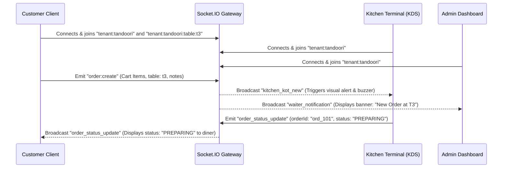

# Frontend Architectural Specification: Multi-Tenant QR Restaurant Ordering SaaS

This specification outlines the production-grade frontend architecture, UI/UX configurations, design system tokens, state structures, and optimization schemes for the Multi-Tenant QR Restaurant Ordering SaaS Platform for India. It is designed to serve as a comprehensive system blueprint.

---

## 1. Complete Frontend Architecture & System Topology

The platform runs on a single Next.js codebase, serving multiple tenants (restaurants) through dynamic edge routing and styling injection. It achieves isolation of customer-facing, merchant admin, kitchen display (KDS), waiter service, and super-admin panels.

### System Architecture Overview

```mermaid
graph TD
    A["QR Code Scan / Subdomain URL (/r/[tenant]/table/[tableId])"] --> B["Next.js Edge Middleware"]
    B -->|Resolves Tenant Slug & Table ID| C["Next.js App Router Engine"]
    
    C -->|Dynamic CSS variables injected at DOM Root| D["Customer App Shell (Mobile-First PWA)"]
    C -->|Staff Session Token check| E["Restaurant Admin Portal"]
    C -->|High Contrast TV/Tablet Shell| F["Kitchen Display System (KDS)"]
    C -->|Floor Service Hub| G["Waiter Operations Hub"]
    C -->|Root Auth Guard| H["Super Admin Control Panel"]

    %% Shared State & Data Services
    D & E & F & G & H -->|Queries & Mutations| I["TanStack Query Cache Layer"]
    D & E & F & G & H -->|Local Reactive States| J["Zustand Global Stores (Cart & UI)"]
    D & E & F & G & H -->|Realtime Channels| K["Socket.IO Client Manager"]

    %% Edge API Interceptors
    I -->|Axios Agent (lib/api.ts)| L["API Gateway / LB"]
    L -->|X-Tenant-ID Header Routing| M["Multi-Tenant Database Schema"]
    K -->|WebSocket Tunnel| N["NestJS Socket.IO Gateways"]
```

### Core Architecture Layers

1. **Routing & Tenant Resolving Layer**: Next.js parses pathname segments (`/r/[tenant]/table/[tableId]`). The `TenantProvider` queries the tenant backend schema and maps feature configurations.
2. **Dynamic Styling & Token Injection Layer**: Custom HSL color variables are bound to the document root element at runtime via `TenantContext.tsx`. This avoids heavy compile-time CSS builds for individual restaurants.
3. **Reactive State Layer**: Uses Zustand for fast client persistence (cart, cooking instructions, active customizers) and TanStack Query for server-side cached state synchronization.
4. **Realtime Pub/Sub Layer**: Establishes a single WebSocket connection through a Socket.IO client singleton. Subscriptions are isolated into tenant and table channels (rooms) to maintain sub-second updates.

---

## 2. UI/UX System & Accessibility Standards

### Core Design Principles

* **Mobile-First Customer Experience**: Dining rooms have weak network coverage and space constraints. All customer interactions are optimized for single-thumb scrolling, bottom-aligned drawer modals, and sticky checkout bars.
* **Large Touch-Target Elements**: All buttons (such as quantity adjusting keys, category filters, customization selectors) maintain a minimum height of `48px` to guarantee tap accuracy on shaking mobile screens.
* **High Contrast Dark Mode UI**: KDS and waiter terminals run on slate-black canvasses (`bg-slate-950`) to minimize screen reflections in bright kitchen environments and improve visibility from a distance of up to 4 meters.

### WCAG 2.1 AA Compliance Matrix

1. **Auto Contrast Check**: The dynamic styling manager calculates text contrast ratios. If a restaurant's uploaded primary color has a contrast ratio below `4.5:1` against white backgrounds, the context controller runs an HSL lightness adjusting algorithm to restore legibility.
2. **Screen Reader Integration**:
   * Vegetarian/Non-Vegetarian tags use custom screen-reader-only labels: `<span className="sr-only">Vegetarian Option</span>`.
   * Quantity change actions emit live audio readouts: `aria-live="polite"` announces: *"Added 1 Butter Naan to Cart"*.
   * Bottom drawers utilize Radix primitive accessibility mappings (`role="dialog"`, `aria-modal="true"`).

---

## 3. Design System & Dynamic HSL Themes

The application theme is governed by dynamic HSL variable overrides. When a tenant is resolved, the CSS custom variables below are injected into the DOM root.

### Brand Color Tokens

| CSS Custom Property | Default Saffron (Tandoori Palace) | Default Emerald (Veg Bite) | Purpose |
| :--- | :--- | :--- | :--- |
| `--background` | `0 0% 100%` | `0 0% 100%` | Main canvas background color |
| `--foreground` | `224 71.4% 4.1%` | `224 71.4% 4.1%` | Text titles and copy |
| `--primary` | `24.6 95% 53.1%` | `142.1 76.2% 36.3%` | Action triggers, badges, and focus borders |
| `--primary-foreground` | `60 9.1% 97.8%` | `355.7 100% 97.3%` | Text copy inside primary buttons |
| `--secondary` | `220 14.3% 95.9%` | `220 14.3% 95.9%` | Background for list chips and secondary panels |
| `--border` | `220 13% 91%` | `220 13% 91%` | Dividing lines and card boundaries |
| `--radius` | `1rem` | `0.5rem` | Border corner rounding radius |
| `--veg` | `142.1 70.6% 45.3%` | `142.1 70.6% 45.3%` | Green FSSAI Veg indicator color |
| `--nonveg` | `0 84.2% 60.2%` | `0 84.2% 60.2%` | Red FSSAI Non-Veg indicator color |

### Typography Scale (Outfit Sans)

The system loads the Google font **Outfit** for dynamic modern text styling. It supports:
* **Section Category Headers**: `font-black tracking-tight text-lg border-b`
* **Dish Item Titles**: `font-extrabold text-sm tracking-tight text-foreground`
* **Descriptions**: `text-xs text-muted-foreground leading-relaxed`
* **Checkout/Totals CTAs**: `font-bold text-xs uppercase tracking-widest`

---

## 4. Frontend Folder Structure

```
/home/enjay/myPP/
├── package.json                    # Project dependencies (Zustand, Query, Socket.io, Framer Motion)
├── tsconfig.json                   # TS configuration and absolute alias mapping (@/*)
├── postcss.config.js               # PostCSS configurations for Tailwind
├── tailwind.config.js              # Tailwind extend bindings mapping custom HSL properties
├── next.config.mjs                 # Asset loaders, headers config, image host authorization
├── public/
│   ├── manifest.json               # Progressive Web App (PWA) manifest configurations
│   └── icons/                      # Launch screens and installable app icons
└── src/
    ├── app/                        # Next.js App Router (File-system routing)
    │   ├── layout.tsx              # Root HTML wrapper, Google Font preconnects, viewports
    │   ├── page.tsx                # SaaS Product Hub (Landing page and portal directories)
    │   ├── r/                      # Customer-facing multi-tenant routes
    │   │   └── [tenant]/
    │   │       ├── layout.tsx      # Injects TenantContext provider for child route segments
    │   │       └── table/
    │   │           └── [tableId]/
    │   │               └── page.tsx # Customer Ordering UI (Search, categories, checkout)
    │   ├── admin/                  # Merchant admin panel routes
    │   │   └── dashboard/
    │   │       └── page.tsx        # Manager tracker, live waiter assistance, QR code generator
    │   ├── kitchen/                # KDS routing
    │   │   └── page.tsx            # Kitchen Display System UI
    │   ├── waiter/                 # Waiter routing
    │   │   └── page.tsx            # Waiter table monitoring system
    │   └── super-admin/            # Platform Operator routing
    │       └── page.tsx            # Root super-admin panel (SaaS metrics, feature flag matrix)
    ├── components/
    │   └── ui/                     # Generic design system components (buttons, input boxes)
    ├── context/
    │   └── TenantContext.tsx       # Dynamic CSS HSL variables and feature flag provider
    ├── hooks/
    │   └── useSocket.ts            # Socket hook wrapping room pub/sub and cleanups
    ├── lib/
    │   ├── api.ts                  # Axios agent with X-Tenant-ID and JWT interceptors
    │   └── socket.ts               # Socket.IO client connection manager (Singleton)
    ├── store/
    │   ├── useCartStore.ts         # Zustand Cart storage with GST tax calculation engine
    │   └── useUIStore.ts           # Zustand UI drawers, modals, filter and search state
    ├── styles/
    │   └── globals.css             # Base Tailwind variables, glass-panels, and scrollbar rules
    └── types/
        └── index.ts                # TypeScript types (Tenant, MenuItem, Order, Table)
```

---

## 5. State Management & Lifecycle Strategy

State is split between client-side persistence (Zustand) and server cache state (TanStack Query):

```
       +---------------------------------------------------------------------------------+
       |                                APPLICATION STATE                                |
       +----------------------------------------+----------------------------------------+
                                                |
                   +----------------------------+----------------------------+
                   |                                                         |
                   v                                                         v
      +--------------------------+                              +--------------------------+
      |  ZUSTAND PERSISTENT STORE|                              |   TANSTACK QUERY CACHE   |
      |   (survives restarts)    |                              |  (sub-second invalidation)|
      +------------+-------------+                              +------------+-------------+
                   |                                                         |
                   +---> Active Cart Items                                   +---> Menu Catalogs
                   +---> Customizer Hash Keys                                +---> Table Occupancies
                   +---> special instructions text                           +---> Sales reports
                   +---> Selected UI language                                +---> Merchant profile logs
```

### Zustand Cart Persist Engine

* **Storage Sync**: Cart data is serialized to `localStorage` via Zustand persist middleware. In regions with poor network coverage, diners can browse and modify their cart without losing data during page reloads.
* **Customization Hash Key**: To support multiple customized versions of the same menu item (e.g. *Portion: Half* vs *Portion: Full*), the cart generates a unique compound key:
  ```typescript
  const generateCartItemId = (menuItemId: string, customizations: SelectedCustomization[]): string => {
    if (customizations.length === 0) return menuItemId;
    const sortedOptionIds = [...customizations]
      .sort((a, b) => a.optionId.localeCompare(b.optionId))
      .map(c => c.optionId)
      .join('-');
    return `${menuItemId}-${sortedOptionIds}`;
  };
  ```

### Indian Taxation Engine (FSSAI/GST Compliant)

Taxes are calculated in real-time based on the tenant's configuration. CGST, SGST, and Service Charges are derived using the following formulas:

$$\text{Subtotal} = \sum (\text{Base Price} + \text{Customization Add-ons}) \times \text{Quantity}$$
$$\text{CGST} = \text{Subtotal} \times \frac{\text{CGST Rate}}{100}$$
$$\text{SGST} = \text{Subtotal} \times \frac{\text{SGST Rate}}{100}$$
$$\text{Service Charge} = \text{Subtotal} \times \frac{\text{Service Charge Rate}}{100}$$
$$\text{Grand Total} = \text{Subtotal} + \text{CGST} + \text{SGST} + \text{Service Charge}$$

### TanStack Query Invalidation

* **Menu Catalog Cache**: Stored for 24 hours under `['tenant', tenantSlug, 'menu']`.
* **Realtime Cache Invalidation**: When a merchant changes an item's availability, the websocket pushes an update that triggers invalidation:
  `queryClient.invalidateQueries({ queryKey: ['tenant', tenantSlug, 'menu'] })`.
  This updates the diner's view instantly without polling.

---

## 6. Realtime WebSocket Architecture

The platform uses a singleton Socket.IO client structure to handle communication between devices.

### WebSocket Room Isolation

Devices are grouped into rooms to ensure messages are delivered only to relevant clients:

* `tenant:{id}`: General room for merchant staff. Receives notifications for new orders and help calls.
* `tenant:{id}:table:{tableId}`: Table-specific room for customers and assigned waiters. Used to push status updates for active orders.
* `customer:{sessionId}`: Dedicated room for pushing payment confirmations and personal alerts.



### Network Drop Recovery & Offline Queueing

* **Automatic Reconnection**: The socket client tries to reconnect up to 10 times, backoff delays increase from 1000ms to 5000ms.
* **Offline Action Queue**: If a waiter updates a table's status while offline, the action is saved to a local queue. The UI displays an offline warning. Once the connection is restored, the queue is processed in order.

---

## 7. Operational Portal UI Flow Specifications

### Customer Ordering Experience

1. **Table Session Entry**: Scanning the physical QR code redirects the diner to `/r/[tenant]/table/[tableId]`. The layout reads the parameters and initializes the socket connection.
2. **Category Selection & Search**: Diners can swipe horizontally through category chips. Tapping a category scrolls the menu to that section.
3. **Veg / Non-Veg Filtering**: Pill controls allow filtering by vegetarian status. If a tenant is configured as veg-only (`isVegOnly: true`), non-veg filters are hidden.
4. **Customizer Sheet**: Selecting customized items opens a bottom sheet. Required customization groups must be satisfied before the item can be added to the cart.
5. **Cart Drawer**: Tapping the cart bar opens a drawer displaying selected items, tax calculations, and a text area for special cooking instructions. Tapping "Confirm and Send" sends the order to the kitchen.
6. **Live Order Status Tracker**: The client redirects to a tracking screen that updates in real-time as the order moves from accepted to preparing, ready, and served.
7. **Waiter Assistance Drawer**: Diners can request specific items (water, bill, cutlery) or call a waiter, sending an immediate alert to the service team.

### Kitchen Display System (KDS)

* **Ticket Layout**: Display cards show order items, quantities, and cooking instructions in large, readable fonts.
* **Visual Status Aging**: Bounding borders change color based on how long the order has been in the queue:
  * **$< 10$ minutes**: Normal (Green border)
  * **$10 - 15$ minutes**: Delayed (Amber pulsing border)
  * **$> 15$ minutes**: Late (Crimson flashing border)
* **Oscillator Buzzer System**: The KDS uses the Web Audio API to synthesize alert tones for new orders, avoiding the need for audio assets and bypassing browser autoplay restrictions:
  ```typescript
  const audioCtx = new (window.AudioContext || window.webkitAudioContext)();
  const osc = audioCtx.createOscillator();
  const gain = audioCtx.createGain();
  osc.connect(gain);
  gain.connect(audioCtx.destination);
  osc.type = 'sine';
  osc.frequency.setValueAtTime(880, audioCtx.currentTime); // A5 tone
  gain.gain.setValueAtTime(0.15, audioCtx.currentTime);
  osc.start();
  osc.stop(audioCtx.currentTime + 0.15);
  ```

---

## 8. Mobile Optimization & Low-Bandwidth Plan

Designed for environments with poor network connectivity:

1. **Bundle Slicing**: The initial JavaScript bundle is kept under **75KB (gzipped)**. Heavy components like customization sheets and analytics charts are loaded lazily.
2. **Image Optimization**: Food images are compressed and served in WebP format on-the-fly, using responsive sizes:
   `sizes="(max-width: 768px) 100vw, (max-width: 1200px) 50vw, 33vw"`
3. **Zero Viewport Zooming**: Disables manual double-tap zooming on mobile screens to prevent layout shifts:
   ```typescript
   export const viewport: Viewport = {
     width: 'device-width',
     initialScale: 1,
     maximumScale: 1,
     userScalable: false,
     viewportFit: 'cover'
   };
   ```

---

## 9. Progressive Web App (PWA) & SEO Strategies

### PWA Offline Strategies

* **Pre-cached App Shell**: The service worker caches key assets (Outfit font files, Lucide icons, layout templates, CSS utilities) on first load.
* **Cache-First for Static Assets**: Static resources are served from the cache, while API requests for menus and prices use a Network-First strategy to ensure accuracy.
* **iOS Safari Integration**: Viewports include safe-area padding (`padding-bottom: env(safe-area-inset-bottom)`) to prevent overlapping with system navigation bars.

### Dynamic SEO Schema (JSON-LD)

To help search engines index restaurant profiles and menus, dynamic JSON-LD schemas are injected:

```json
{
  "@context": "https://schema.org",
  "@type": "FoodEstablishment",
  "name": "Tandoori Palace",
  "image": "https://images.unsplash.com/photo-1603894584373-5ac82b2ae398?w=500",
  "acceptsReservations": "false",
  "priceRange": "$$",
  "menu": "https://qr-ordering.in/r/tandoori-palace/table/t3",
  "address": {
    "@type": "PostalAddress",
    "streetAddress": "Park Street 12",
    "addressLocality": "Kolkata",
    "addressRegion": "West Bengal",
    "addressCountry": "IN"
  }
}
```

---

## 10. Future Scalability Roadmap

1. **Edge Middleware Resolution**: Deploy Next.js middleware to edge networks (Cloudflare Workers, Vercel Edge) to validate tenant status, perform geo-routing, and check auth tokens before hitting database clusters.
2. **IndexedDB Offline Sync**: Replace the memory queue with an IndexedDB storage engine. This allows offline waiter logs to persist even if a browser is closed before reconnecting.
3. **Micro-Frontend Architecture**: As merchant features expand (e.g. inventory tracking, shift management), split dashboards into independent micro-frontends to keep the core customer application bundle size under 100KB.
4. **i18n Localization Support**: Implement localization dictionaries to translate menus into regional Indian languages (Hindi, Telugu, Tamil, Kannada, Bengali) based on client locale.
